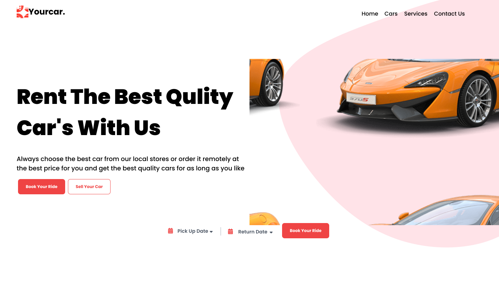

<h1 align="center">
  
</h1>

<p align="center">
    
</p>

<br>

## 💻 Project

Yourcar is a responsive website, a car e-commerce.

## 🧪 Development

This project was developed using:

- [React](https://reactjs.org)
- [TypeScript](https://www.typescriptlang.org/)
- [Tailwind CSS](https://tailwindcss.com/)
- [styled-components](https://styled-components.com/)
- [Apollo GraphQL](https://apollographql.com/)
- [Express](https://expressjs.com/)
- [NestJS](https://nestjs.com/)

## 🚀 Running

To start the project, execute the following commands:

#### Back End
```bash
# To install all backend dependencies
$ cd backend
$ yarn

# To start the server
$ yarn start:dev
```

#### Front End

> Open a new terminal

```bash
# To install all frontend dependencies
$ cd frontend
$ yarn

# To start the project
$ yarn start
```
The app will be available on the browser by accessing the address http://localhost:3000.